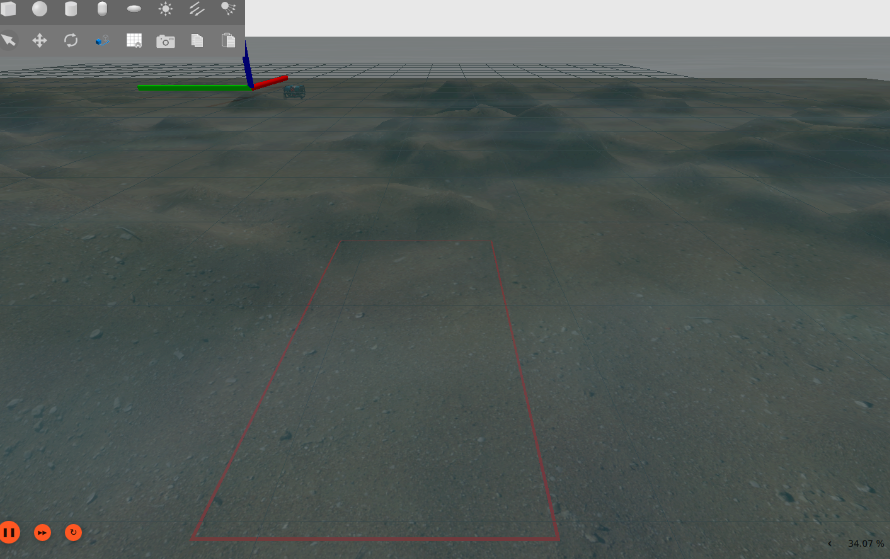
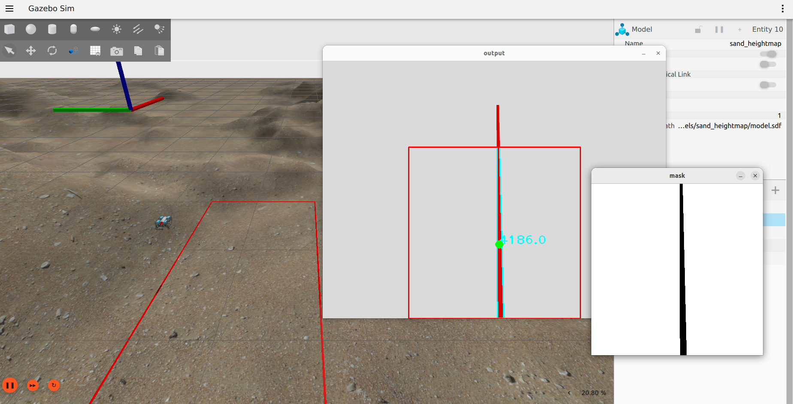

## Introduction
This repository was cloned from Clyde Mcqueen's Orca4. Changes have been made in multiple directories/packages by Felix Q. Bueno IV (fqbueno@up.edu.ph) and James Adrian V. Perez (jvperez2@up.edu.ph) for their research entitled **Integration of ROS2 and Gazebo for Underwater ROV Control** at the Computer Vision and Machine Intelligence Lab (CVMIL) at the University of the Philippines - Diliman. Their research has modified the Gazebo simulation environment as well as added another AUV Mission which is the Line-following mission. The Line-following mission was implemented by using a PID Controller and a Fuzzy PID Controller.

Specifically, files have been added and changes have been made to the following packages:
* [`orca_bringup` Launch files](orca_bringup)
* [`orca_description` SDF files](orca_description)
* [`gazebo_scripts` movement through gazebo only](gazebo_scripts)

# Orca4 

Orca4 is a set of [ROS2](http://www.ros.org/) packages that provide basic AUV (Autonomous Underwater
Vehicle) functionality for the [BlueRobotics BlueROV2](https://www.bluerobotics.com).

Orca4 uses [ArduSub](http://www.ardusub.com/) as the flight controller and
[mavros](https://github.com/mavlink/mavros) as the GCS.

Orca4 runs in [Gazebo Garden](https://gazebosim.org/home) using the standard buoyancy, hydrodynamics and thruster
plugins. The connection between ArduSub and Gazebo is provided by [ardupilot_gazebo](https://github.com/ArduPilot/ardupilot_gazebo).

## Sensors

The BlueROV2 provides the following interesting sensors:
* An [external barometer](https://bluerobotics.com/product-category/sensors-sonars-cameras/sensors/) provides depth
* An IMU provides attitude

Orca4 adds a simulated down-facing stereo camera and [ORB_SLAM2](https://github.com/clydemcqueen/orb_slam_2_ros/tree/orca4_galactic)
to generate a 3D pose as long as the camera has a good view of the seafloor.
The pose is sent to ArduSub and fused with the other sensor information.

If there is no view of the seafloor a synthetic pose is generated based on the last good pose and a simple motion model.

See [orca_base](orca_base/README.md) for details.

## Navigation

Orca4 uses the [Navigation2](https://navigation.ros.org/index.html) framework for mission
planning and navigation. Several simple Nav2 plugins are provided to work in a 3D environment:
* straight_line_planner_3d
* pure_pursuit_3d
* progress_checker_3d
* goal_checker_3d 

See [orca_nav2](orca_nav2/README.md) for details.

## Installation

See the [Dockerfile](docker/Dockerfile) for installation details.

Install these packages:
* [ROS2 Humble](https://docs.ros.org/en/humble/Installation.html)
* [Gazebo Garden 7.1.0](https://gazebosim.org/docs/garden/install)
* [ardupilot_gazebo](https://github.com/ArduPilot/ardupilot_gazebo)
* [ArduSub](https://ardupilot.org/dev/docs/building-setup-linux.html)

Build ArduSub for SITL:
~~~
cd ~/ardupilot
./waf configure --board sitl
./waf sub
~~~

Populate the workspace:
~~~
mkdir -p ~/colcon_ws/src
cd colcon_ws/src
git clone https://github.com/fqbueno/orca4.git
vcs import < orca4/workspace.repos
~~~

Build ros_gz for Garden, not Fortress:
~~~
export GZ_VERSION=garden
~~~

Get dependencies, ignoring Gazebo Garden rosdep keys:
~~~
rosdep update
rosdep install -y --from-paths . --ignore-src --skip-keys="gz-transport12 gz-sim7 gz-math7 gz-msgs9"
~~~

MAVROS depends on GeographicLib, and GeographicLib needs some datasets:
~~~
sudo mavros/mavros/scripts/install_geographiclib_datasets.sh
~~~

Build the workspace:
~~~
cd ~/colcon_ws
colcon build
~~~

## Simulation

In a terminal run:
~~~
source src/orca4/setup.bash
ros2 launch orca_bringup sim_launch.py
~~~

This will bring up all of the components, including the Gazebo UI.
The surface of the water is at Z=0 and the sub will be sitting at the surface.
The world contains a sandy seafloor 10 meters below the surface.

You should see ArduSub establish a connection to the ardupilot_gazebo plugin:
~~~
[ardusub-2] JSON received:
[ardusub-2] 	timestamp
[ardusub-2] 	imu: gyro
[ardusub-2] 	imu: accel_body
[ardusub-2] 	position
[ardusub-2] 	quaternion
[ardusub-2] 	velocity
~~~

The [base_controller](orca_base/src/base_controller.cpp) node will send default camera poses to ArduSub
to warm up the EKF and the [manager](orca_base/src/manager.cpp) node will request attitude information at 20Hz.
Initialization completes when there is a good pose from the EKF:

~~~
[mavros_node-8] [INFO] [mavros.imu/handle_attitude_quaternion]: IMU: Attitude quaternion IMU detected!
[manager-9] [INFO] [manager/operator()]: EKF is running
[base_controller-10] [INFO] [base_controller/change_state]: EKF is running, state => RUN_NO_MAP
[base_controller-10] [INFO] [base_controller/UnderwaterMotion]: initialize odometry to {{-2.52304e-05, -3.28182e-05, -0.228547}, {0, 0, -5.00936e-05}}
~~~

Execute a mission in a second terminal (either using regular PID Controller or Fuzzy PID Controller.
For regular PID Controller: 
~~~
source src/orca4/setup.bash
ros2 run orca_bringup mission_run_pid.py
~~~

For Fuzzy PID Controller: 
~~~
source src/orca4/setup.bash
ros2 run orca_bringup mission_run_fuzzypid.py
~~~

In the two missions, the robot will first dive to -3m. After this, start the follower callback in another terminal:
~~~
ros2 service call /start_follower std_srvs/srv/Empty
~~~

The robot will now follow the rectangular line in the environment. You can stop the Line-following by executing:
~~~
ros2 service call /stop_follower std_srvs/srv/Empty
~~~

## Packages

* [`orca_base` Base controller, localization, frames](orca_base)
* [`orca_bringup` Launch files](orca_bringup)
* [`orca_description` SDF files](orca_description)
* [`orca_msgs` Custom messages](orca_msgs)
* [`orca_nav2` Nav2 plugins](orca_nav2)
* [`orca_shared` Dynamics model, shared utilities](orca_shared)
